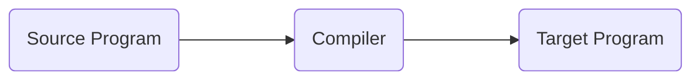
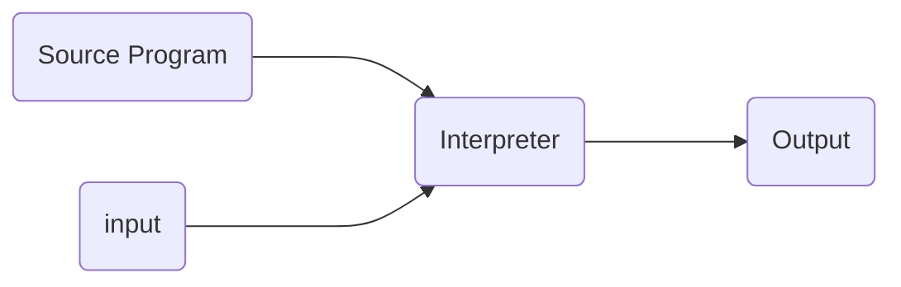

# Compiler Design
---

## Language Processors

A compiler is a program that can read a program in one language (source language) and translate it into an equivalent program in another language(target language)

- important role of compiler - report any errors in the source program.

## Lexical Analysis
- First phase of a compiler
- The lexical analyzer - reads stream of characters(source program) - groups the characters into meaningful sequences called lexemes.
- For each, lexical analyzer produces a $tokens$ of the form

$$
<token-name, attribute-value>
$$
