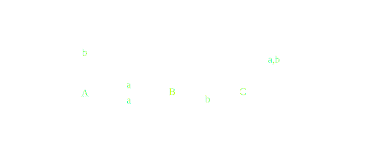

#### Deterministic Finite Automata
---
A deterministic FSM (or DFSM) M is a quintuple $(K, \sum, \delta, s, A)$, where:

- $K$ is a finite set of states
- $\sum$ is the input Alphabet
- $s \in K$ is the start state
- $A \subseteq K$ is the set of accepting state
- $\delta$ is the transition function

The language accepted by [[Deterministic Finite Automata|DFSM]] M, denoted $L(M)$, is the set of string accepted by M.

$$
\begin{align}
For\ Exam&ple,\\
&Let\ L = \{w \in \{a, b\}^*: every\ a\ region\ in\ w\ is\ of\ even\ length\}
\end{align}
$$

##### Transition Table
states/input | a | b
---| --- | ---
-> * A | B | A
B | A | C
C | C | C

##### Theorem ![[DFSM Halts]]
>[!Info]
>Theorem: Every [[Deterministic Finite Automata|DFSM]] M, on input w, halts after $|w|$ steps.

[Non-deterministic Finite Automata](obsidian://open?vault=Theory%20Of%20Computation&file=Non-deterministic%20Automata)

