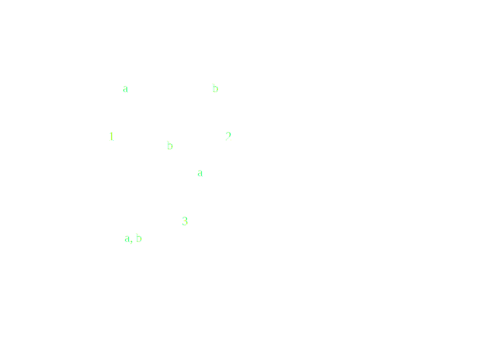

#### Language Hierarchy
---
##### A Machine-Based Hierarchy of Language Classes

- ###### The Regular Languages

	- We will call the class of languages that can be accepted by some [[Finite Automata|FSM]] **regular**.

$$
\begin{align}
for\ examp&le,\\
&Let\ L = \{w \in \sum*: where\ all\ a’s\ come\ before\ all\ b’s\}\\
&\{a, b\} \in \sum
\end{align}
$$

- ###### The Context-Free Languages
	- The language which is not accepted by FSM and accepted by **Pushdown Automata** a **Context-Free** Languages

$$
\begin{align}
For\ examp&le,\\
&Let\ A^nB^n = \{a^nb^n:n \ge 0\}\\
&\{a, b\} \in \sum
\end{align}
$$
![[anbn.svg]]
#### The Decidable and Semdecidable Languages
##### Turing Machine
We will get rid of the stack of **Pushdown automata** and replace it with an infinite tape. The tape will have a single read/write head. Only the tape square under the read/write head can be accessed (for reading or for writing). The read/write head can be moved one square in either direction on each move. The resulting machine is called a **Turing machine**

 - A language L is decidable iff there exists a Turing machine M that halts on all inputs, accepts all strings that are in L, and rejects all strings that are not in L. In other words, M can always say yes or no, as appropriate.
 - A language L is semidecidable iff there exists a Turing machine M that halts on all inputs, accepts all strings that are in L, and fails to accept every string that is not in L. Given a string that is not in L, M may reject or it may loop forever. In other words, M can recognize a solution and then say yes, but it may not know when it should give up looking for a solution and say no.